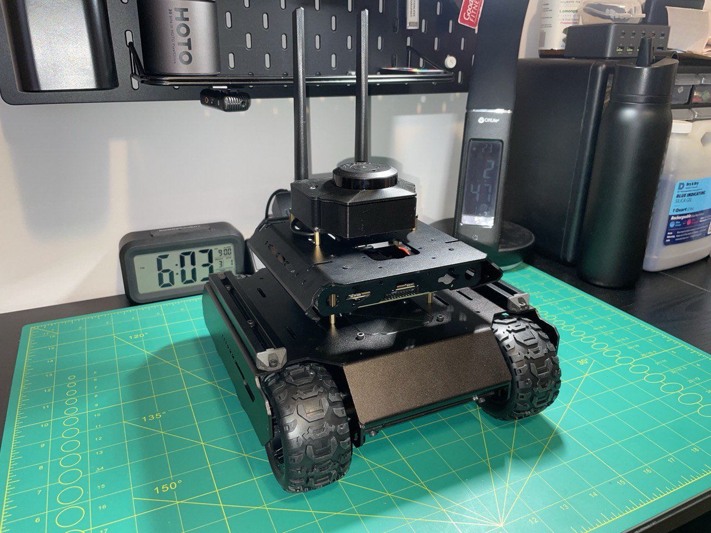

# Autonomous Rover - Jetson + ROS2 Navigation

A 4WD autonomous ground robot built on the Waveshare UGV02 platform with an NVIDIA Jetson Orin Nano Super, running ROS2 Humble with live SLAM and Nav2 autonomous navigation.


## Project Overview

**Goal:** Build a production-ready autonomous navigation system from scratch to demonstrate ROS2 development skills.

**Why This Project:**
- Master ROS2 architecture (nodes, topics, services, actions)
- Implement SLAM-based mapping and localization
- Deploy autonomous waypoint navigation with Nav2
- Document real engineering problem-solving
- Build an AI-ready platform for future computer vision integration



## Hardware Platform

### Core Components
- **Platform:** Waveshare UGV02 (4WD skid-steer chassis)
- **Compute:** NVIDIA Jetson Orin Nano Super Developer Kit (8GB RAM, 67 TOPS AI)
- **Sensors:** Slamtec RPLidar C1 (12m range, 10Hz, TOF technology)
- **Power:** 3× 18650 cells in series via WaveShare UPS Module 3S
- **Motor Control:** Multi-Functional Driver (MFD) board over USB serial (`/dev/rover`), running closed-loop wheel speed control

### Technical Specifications

| Component | Specification |
|-----------|---------------|
| **Drivetrain** | 4× DCGM-370-12V-EN-333RPM motors, skid-steer kinematics |
| **Encoder Resolution** | ~20 PPR (front wheels only; rear wheels unencoded) |
| **Motor Stall Torque** | ~5.0 kg·cm |
| **CPU** | 6-core ARM Cortex-A78AE @ 1.7GHz |
| **GPU** | 512 CUDA cores + Tensor cores (67 TOPS) |
| **RAM** | 8GB LPDDR5 |
| **LiDAR Range** | 12m max (white objects); 6m (black objects) |
| **LiDAR Scan Rate** | 5kHz sample rate @ 10Hz rotation |
| **LiDAR Angular Resolution** | 0.72° typical |
| **Light Resistance** | 40,000 lux |
| **Battery Pack** | 3S 18650, 11.1V nominal, 12.6V full charge |

### Power Architecture

| Component | Power Source |
|-----------|-------------|
| Jetson Orin Nano Super | BAT rail (9 to 12.6V) via 5.5mm barrel jack |
| MFD Board | BAT rail (9 to 12.6V) direct |
| RPLidar C1 | Jetson Orin Nano Super USB port |

### Runtime Estimates (15W Jetson mode, 25% real-world derating applied)

| Motor Load | Estimated Runtime |
|------------|------------------|
| Cruising | ~56 min |
| Under load | ~39 min |

15W mode is the operational standard for SLAM sessions. It balances compute performance
with sufficient runtime for a full mapping run.

## Software Stack

- **Operating System:** Ubuntu 22.04 LTS (JetPack 6.2.1)
- **ROS Distribution:** ROS2 Humble Hawksbill
- **Navigation Framework:** Nav2 with the Regulated Pure Pursuit controller
- **SLAM Algorithm:** slam_toolbox (synchronous mapping mode, CeresSolver)
- **Odometry:** rf2o_laser_odometry (Range Flow-based 2D Odometry from laser scans)
- **Visualization:** RViz2
- **Development Languages:** Python 3.10, C++17

## Current Status

**Last Updated:** September 25, 2026

The rover navigates autonomously. Nav2 plans and follows paths on a map that
slam_toolbox builds live, and the rover drives to goal poses set in RViz, including
through narrow gaps. Pose estimation comes from the LiDAR: `rf2o_laser_odometry`
computes planar odometry from consecutive laser scans and owns the `odom → base_link`
transform. It replaced gyrodometry as the primary odometry source because gyroscope
calibration depends on both driving surface and operating temperature, while the LiDAR
is unaffected by either.

The `rover_driver` node converts velocity commands into wheel speed targets in m/s for
the MFD board's closed-loop speed controller, and lifts small non-zero commands to a
0.10 m/s floor that the controller can regulate. It also applies a velocity ramp, a
command watchdog, and Zero Velocity Update (ZUPT), and publishes wheel odometry on
`/odom_wheel`, raw gyroscope data on `/imu/gz`, and battery voltage on
`/battery_voltage`. Its heading hold controller is implemented but disabled, because
Nav2 runs its own closed loop.

### Completed Milestones

**Hardware:**
- ✅ Full mechanical assembly with custom 3D-printed MFD cover and RPLidar mount
- ✅ Power architecture designed and validated, with both boards on the BAT rail
- ✅ Persistent USB device symlinks: `/dev/lidar` (RPLidar C1), `/dev/rover` (MFD board)
- ✅ Platform migration from Wave Rover to UGV02 (motivated by encoder availability)

**Software:**
- ✅ JetPack 6.2.1 flashed and configured
- ✅ ROS2 Humble installed and verified
- ✅ Remote access via PuTTY (SSH) and NoMachine (desktop)
- ✅ RPLidar C1 driver built from source, with a live `/scan` topic confirmed
- ✅ `rover_driver` ROS2 node: full `/cmd_vel` to MFD JSON bridge operational
- ✅ `robot_description` package: URDF with a measured `base_link → laser` transform (0.1685 m height, 180° yaw)
- ✅ SLAM Toolbox configured in synchronous mapping mode with CeresSolver
- ✅ Gyrodometry implemented: gyroscope (`gz`) for heading, encoder average `(odl + odr) / 2` for linear displacement
- ✅ First coherent SLAM map produced with gyrodometry active
- ✅ Software velocity ramp on both axes: linear (0.8 m/s²) and angular (2.0 rad/s²)
- ✅ Forward-only heading hold PD controller: gyro-based straight-line correction with settle gate, deadband, spike clamp, and output cap
- ✅ Zero Velocity Update (ZUPT): continuous gyro bias correction during stationary pauses
- ✅ SLAM Toolbox parameters tuned: 1 s map updates, full 10 Hz scan ingestion, and a 15 m loop closure search radius
- ✅ `rf2o_laser_odometry` built from source and integrated, publishing `/odom` at 10 Hz
- ✅ Odometry architecture migrated to LiDAR-primary: RF2O owns `odom → base_link`, and wheel odometry is retained on `/odom_wheel` for comparison
- ✅ First geometrically accurate room map, with single-cell walls and every room feature correctly placed
- ✅ LiDAR orientation corrected in the URDF: the RPLidar C1's zero-bearing beam faces the rear of the rover
- ✅ Motor constants measured: `MAX_WHEEL_SPEED = 0.956 m/s` (LiDAR wall ranging), `TRACK_WIDTH = 0.174 m` (caliper), acceleration 0.648 m/s², deceleration 0.699 m/s²
- ✅ Nav2 integrated with Regulated Pure Pursuit: autonomous navigation to goal poses, including through narrow gaps
- ✅ `/cmd_vel` watchdog: the rover stops if commands stop arriving for 0.5 s
- ✅ Battery monitoring on `/battery_voltage`, with warnings at 10.5 V and 9.6 V
- ✅ RF2O startup race fixed: the laser pose lookup now retries until the transform exists (patched fork)
- ✅ Wheel commands sent in m/s to the MFD's closed-loop speed controller, with a 0.10 m/s floor that makes low-speed motion and in-place rotation reliable on every surface tested
- ✅ Repository builds from a fresh clone, with third-party packages pinned in `rover.repos`
- ✅ Desktop launchers for bringup, teleop, and Nav2

### Known Hardware Notes

- **MFD encoder wiring swap:** The `odl`/`odr` odometry fields in the MFD's T:1001 feedback
  packet are physically reversed, so left and right encoder readings are swapped on the
  board. All odometry code accounts for this swap.
- **Front-wheel-only encoding:** Only the front axle motors carry encoders. Rear wheels are
  passive and unencoded. Odometry is computed from front wheel data only.
- **Speed control floor:** The MFD's closed-loop wheel speed control cannot regulate
  targets below about 0.08 m/s, the limit of its 20 PPR encoders. `rover_driver` lifts
  any non-zero command below that to 0.10 m/s.
- **Skid-steer scrub:** In-place rotation achieves about 43% of the rate predicted from
  wheel speeds, consistently across surfaces, which corresponds to an effective track
  width of about 0.405 m. Nav2's closed loop absorbs the difference.
- **LiDAR zero bearing faces rearward:** With the RPLidar C1 mounted as documented, its
  zero-bearing beam points to the rear of the rover. The URDF laser joint carries a 180°
  yaw to match.
- **Battery sag under hard acceleration:** Commanding all four motors from a standstill at
  full speed causes a simultaneous peak current draw that can sag the battery below the
  Jetson's minimum operating voltage, triggering a protective shutdown. A software velocity
  ramp in `rover_driver` limits acceleration to 0.8 m/s² and eliminates the shutdown under
  normal operation.
- **ttyTHS1 UART bug:** The Jetson Orin Nano has a known data corruption bug on `/dev/ttyTHS1`
  requiring RTS/CTS hardware flow control. See the Session 002 log for the full fix.
  Rover communication uses the MFD's dedicated USB serial port (`/dev/rover`) for reliability.
- **UPS power rail routing:** The Jetson must be powered from the BAT rail via barrel jack,
  not the 5V regulated output. The 5V buck converter cannot handle the combined load of
  the MFD board and Jetson simultaneously.

## Getting Started

### Requirements

- Jetson running Ubuntu 22.04 (JetPack 6.2.1) with ROS2 Humble
- The ROS packages and tools the stack uses:

```bash
sudo apt install ros-humble-slam-toolbox ros-humble-navigation2 ros-humble-nav2-bringup \
  ros-humble-teleop-twist-keyboard python3-vcstool python3-serial
```

- The `/dev/rover` udev symlink for the MFD board (see [`src/rover_driver/README.md`](src/rover_driver/README.md))

### Build

The repository is a complete colcon workspace. The launchers and the Nav2 command below
assume it lives at `~/ros2_ws`.

```bash
git clone https://github.com/ArshamFN/WaveShare-Jetson-ROS2-Rover.git ~/ros2_ws
cd ~/ros2_ws
vcs import src < rover.repos
source /opt/ros/humble/setup.bash
colcon build --symlink-install
source install/setup.bash
```

`vcs import` pulls the two third-party packages at the exact commits pinned in
`rover.repos`: a patched fork of `rf2o_laser_odometry` and Slamtec's `rplidar_ros`.

### Run

Bring up the driver, LiDAR, RF2O, and slam_toolbox in one command:

```bash
ros2 launch robot_description bringup.launch.py
```

Add `use_rviz:=true` to open RViz on the Jetson. Then, in separate terminals, drive
with the keyboard:

```bash
ros2 run teleop_twist_keyboard teleop_twist_keyboard
```

or start Nav2 and send goals from RViz with the Nav2 Goal tool (Fixed Frame `map`):

```bash
ros2 launch nav2_bringup navigation_launch.py use_sim_time:=false \
  params_file:=$HOME/ros2_ws/src/robot_description/config/nav2_params.yaml
```

### Desktop Launchers

`tools/launchers/` holds one-click desktop launchers for bringup, teleop, and Nav2. To
install them:

```bash
mkdir -p ~/bin
for s in bringup_rover teleop_rover nav2_rover; do ln -sf ~/ros2_ws/tools/launchers/$s.sh ~/bin/$s.sh; done
cp ~/ros2_ws/tools/launchers/*.desktop ~/Desktop/
for d in ~/Desktop/Rover*.desktop; do chmod +x "$d"; gio set "$d" metadata::trusted true; done
```

The `.desktop` files point at `/home/arshamfn/bin`; adjust their `Exec` lines for a
different user.

### Repository Layout

```
.gitignore  LICENSE  README.md  rover.repos
cad/                       CAD files for the custom covers and mounts
docs/                      bill of materials, software notes, and session logs
images/                    build and test photos
maps/                      saved slam_toolbox maps
scripts/                   calibration and test scripts
tools/launchers/           desktop launchers for bringup, teleop, and Nav2
src/rover_driver/          /cmd_vel to MFD bridge
src/robot_description/     URDF, launch files, and parameters
src/rf2o_laser_odometry/   not tracked; pulled via rover.repos
src/rplidar_ros/           not tracked; pulled via rover.repos
```

## ROS2 Packages

### rover_driver
A ROS2 Python node that bridges the standard `/cmd_vel` topic to the UGV02 MFD board's
JSON-over-serial protocol. It converts each `geometry_msgs/Twist` into left and right
wheel speed targets in m/s, which the board's closed-loop controller holds. Non-zero
targets below the controller's regulation floor are scaled up together to 0.10 m/s,
preserving the commanded turn curvature. The node also applies a velocity ramp on both
axes, stops the rover if `/cmd_vel` goes stale for 0.5 s, and runs ZUPT for continuous
gyro bias correction. It publishes wheel-derived odometry to `/odom_wheel`, raw
gyroscope data to `/imu/gz`, and battery voltage to `/battery_voltage`. It does not
broadcast `odom → base_link`; that transform is owned by `rf2o_laser_odometry`. A
forward-only heading hold PD controller is implemented but disabled by default, because
Nav2 runs its own closed loop.

```bash
ros2 run rover_driver rover_driver_node
```

See [`src/rover_driver/README.md`](src/rover_driver/README.md) for full setup instructions.

### robot_description
A ROS2 package containing the rover's URDF, launch files, and parameters. The URDF
defines the `base_link → laser` transform at 0.1685 m height with a 180° yaw, derived
from physical measurement. `bringup.launch.py` starts `robot_state_publisher`,
`rover_driver`, the LiDAR driver, RF2O (after 3 s), and slam_toolbox (after 5 s), with
optional RViz. The `config/` directory holds the slam_toolbox, RF2O, and Nav2
parameters. slam_toolbox is tuned for 1 s map updates, full 10 Hz scan ingestion, and
a 15 m loop closure search radius suited to indoor mapping.

```bash
ros2 launch robot_description bringup.launch.py
```

### rf2o_laser_odometry
Range Flow-based 2D Odometry: estimates planar motion directly from consecutive
RPLidar scans and publishes `nav_msgs/Odometry` to `/odom` along with the
`odom → base_link` transform. Built from a fork of the Adlink-ROS ROS2 port, patched
so the node retries its `base_link → laser` lookup at startup instead of silently
falling back to an identity transform. Its parameters live in
`src/robot_description/config/rf2o_params.yaml`, including an empty
`init_pose_from_topic`: left at its default of `/base_pose_ground_truth`, a
simulation-only topic, the node waits indefinitely on real hardware.

See [`docs/software/rf2o-laser-odometry.md`](docs/software/rf2o-laser-odometry.md) for build notes.

### rplidar_ros
Slamtec's official ROS2 LiDAR driver, built from source to include RPLidar C1 support.

```bash
ros2 launch rplidar_ros rplidar_c1_launch.py
```

See [`docs/software/rplidar-ros.md`](docs/software/rplidar-ros.md) for full setup instructions.

## Documentation

- [Bill of Materials](docs/hardware/bill-of-materials.md): complete parts list with suppliers and costs
- [Test Logs & Build Journal](docs/testing/0000-test-logs.md): full session-by-session build history
- [RF2O Laser Odometry notes](docs/software/rf2o-laser-odometry.md)
- [RPLidar ROS2 driver notes](docs/software/rplidar-ros.md)

## Author

**Arsham Faghihnasiri**

Building autonomous systems and learning production ROS2 development.

- 📍 Greater Toronto Area, Ontario, Canada
- 💼 [LinkedIn](https://www.linkedin.com/in/arsham-faghihnasiri)
- 📧 arshamfaghihnasiri@gmail.com
- 🎓 Software Engineering

## Acknowledgments

- Waveshare for the UGV02 platform and MFD board
- NVIDIA for Jetson developer tools and documentation
- Slamtec for the RPLidar SDK and ROS2 driver
- MAPIRlab for rf2o_laser_odometry, and Adlink-ROS for its ROS2 port
- The ROS2 and Nav2 open source communities

## License

MIT License. See [LICENSE](LICENSE) for details.
