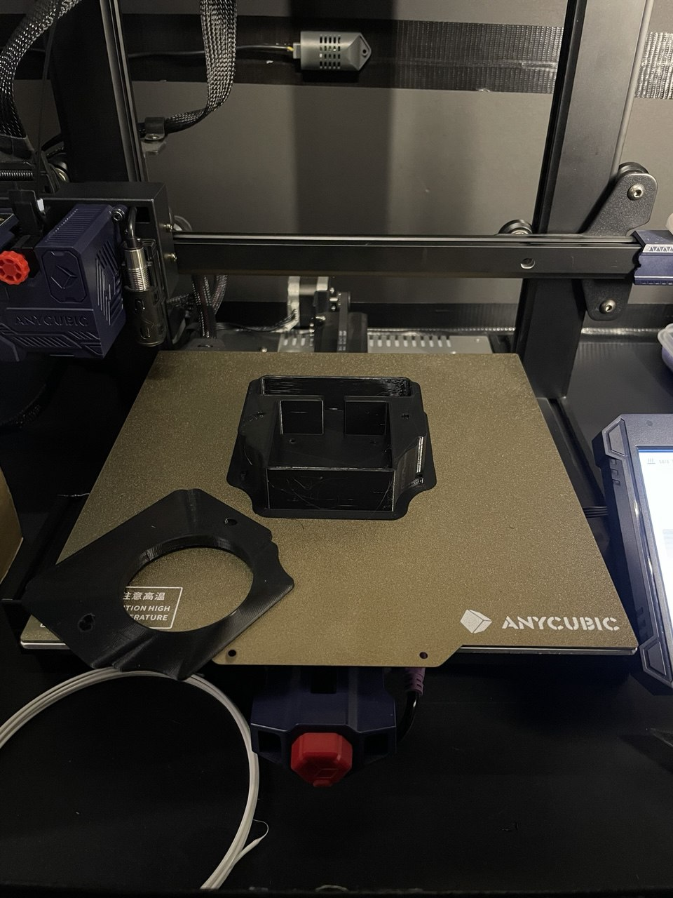
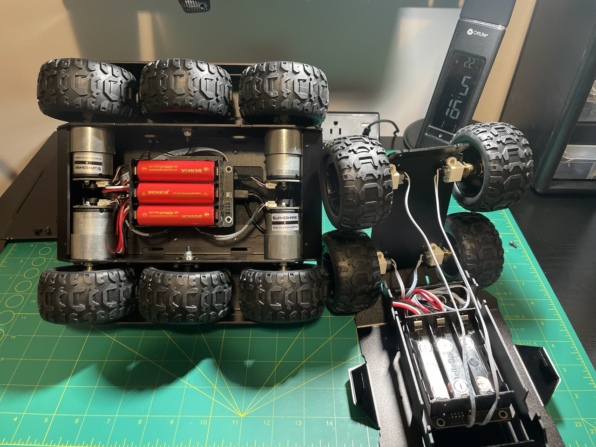
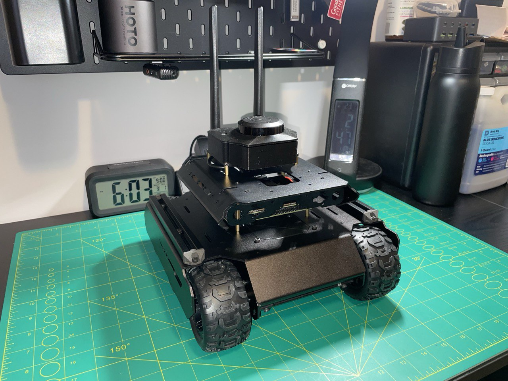
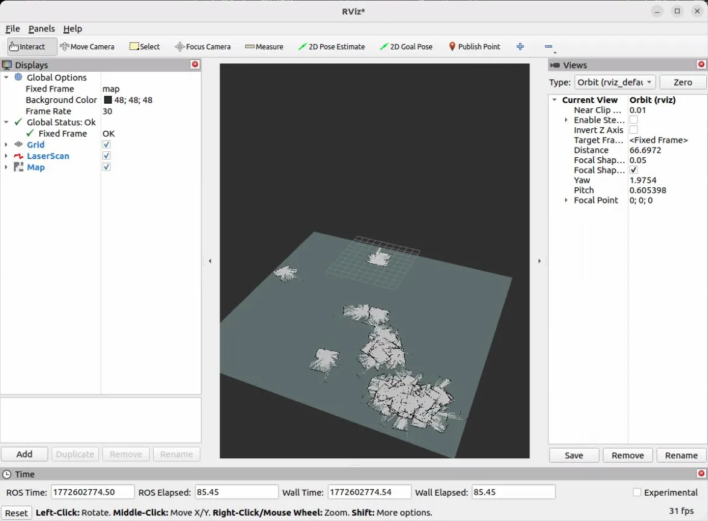

# Test Logs & Build Journal

## Purpose
This file serves as an index of all session logs. Each session has its own
dedicated file in this folder with full details.

---

## Session Index

| Session | Date | Title | Status |
|---------|------|-------|--------|
| 000 | 2026-02-16 | Project Kickoff & Parts Ordered | ✅ Complete |
| 001 | 2026-02-21 | Jetson Setup, Remote Access & UART Debugging | ✅ Complete |
| 002 | 2026-02-22 | UART Debugging & Breakthrough | ✅ Complete |
| 003 | 2026-02-22 | CAD Design — GRD Cover & RPLidar Mount | ✅ Complete |
| 004 | 2026-02-25 | Power Debugging, LiDAR Integration & ROS2 Motor Control | ✅ Complete |
| 005 | 2026-02-27 | URDF, tf2, and First SLAM Map | ✅ Complete |
| 006 | 2026-03-01 | Hardware Assessment & Platform Migration: Wave Rover → UGV02 | ✅ Complete |
| 007 | 2026-03-02 | First Teleoperated SLAM Run & Odometry Calibration | ⚠️ Partial |

---

## Session 000 — 2026-02-16: Project Kickoff & Parts Ordered
**Goal:** Finalize platform choice, create GitHub repository, and order all components.

**Summary:** Platform research completed and all hardware decisions finalized.
Repository created and documentation structure set up. All components ordered
for ~$760 CAD total. No issues encountered.

---

## Session 001 — 2026-02-21: Jetson Setup, Remote Access & UART Debugging
**Goal:** Set up the Jetson Orin Nano Super, establish remote access,
and achieve working UART communication with the Wave Rover.

**Summary:** Jetson successfully flashed, configured, and updated to JetPack 6.2.1.
Remote access established via PuTTY (SSH) and NoMachine (desktop). ROS2 Humble
installed successfully. Rover wired to Jetson — no existing documentation for this
hardware combination, so the process was pieced together from multiple sources.
UART communication established but all received data was garbled. Continued in Session 002.

**→ [Full session log](2026-02-20-session-001-jetson-setup-uart-debugging.md)**

---

## Session 002 — 2026-02-22: UART Debugging & Breakthrough
**Goal:** Identify root cause of garbled UART data and establish working
communication with the Wave Rover.

**Summary:** Two compounding hardware issues identified and resolved. First, the
Jetson Nano Adapter (C) was inserted upside down, holding the ESP32's boot pin
at the wrong voltage. Second, the Jetson Orin Nano has a known ttyTHS1 data
corruption bug that requires RTS/CTS hardware flow control. Fixed by enabling
uarta-cts/rts in jetson-io and adding a jumper between pins 11 and 36. UART
communication fully working — rover moves on command from the Jetson. ✅

**→ [Full session log](2026-02-22-session-002-UART-breakthrough.md)**

---

## Session 003 — 2026-02-22: CAD Design — GRD Cover & RPLidar Mount

**Goal:** Finalize CAD designs for the custom GRD electronics cover and
RPLidar C1 mounting case while waiting for antenna and standoff spacers to arrive.

**Summary:** Both CAD designs completed in Fusion 360. The GRD cover is a
functional redesign of the rover's original plastic electronics bay cap, adding
openings for the 40-pin header, improved OLED visibility, and WiFi antenna cable
routing. The RPLidar C1 mount was designed from scratch to secure the sensor
to the rover. No physical assembly this session — parts still in transit.

**→ [Full session log](2026-02-22-session-003-cad-grd-cover-lidar-mount.md)**

---

## Session 004 — 2026-02-25: Power Debugging, LiDAR Integration & ROS2 Motor Control
**Goal:** Resolve power system fault from first full assembly boot, integrate the
RPLidar C1 into ROS2, and achieve complete rover motor control through the `/cmd_vel`
topic.
**Summary:** UPS power fault diagnosed and resolved — root cause was the Jetson's
Type-C standby draw overloading the 5V buck converter. Power architecture redesigned
to route both boards through the BAT rail, reserving the 5V output for peripherals.
Runtime analysis completed for the BENKIA 18650 pack across all Jetson power modes —
15W mode recommended for SLAM sessions (~56 min runtime). DisplayPort emulator ordered
to resolve headless NoMachine GPU issue. Persistent udev symlinks established for both
USB serial devices (`/dev/lidar`, `/dev/rover`). RPLidar C1 driver built from source
and confirmed publishing live `/scan` data. Rover communication switched to USB serial
for reliability. `rover_driver` ROS2 node written and deployed — full end-to-end motor
control via `/cmd_vel` confirmed. ✅

**→ [Full session log](2026-02-24-session-004-power-architecture-LiDAR-integration-ROS2-motor-control.md)**

---

## Session 005 — 2026-02-27: URDF, tf2, and First SLAM Map
**Goal:** Create the `robot_description` ROS2 package, configure SLAM Toolbox,
and achieve a live occupancy grid map in RViz2.

**Summary:** Authored a Unified Robot Description Format (URDF) with accurate
real-world LiDAR transform measurements — 0.1685m z offset derived from physical
measurement, with zero x/y offsets by deliberate mechanical design. Verified the
tf2 transform tree with `tf2_tools view_frames`. Installed SLAM Toolbox and wrote
a full `slam_toolbox.yaml` configuration. Deployed a SLAM launch file with a
static `odom → base_link` placeholder for future wheel odometry. Full pipeline
confirmed: RPLidar C1 → `/scan` → SLAM Toolbox → `/map` → RViz2, with a live
occupancy grid map of the room visible. ✅

**→ [Full session log](2026-02-27-session-005-URDF-tf2-and-first-SLAM-map.md)**

---

## Session 006 — 2026-03-01: Hardware Assessment & Platform Migration: Wave Rover → UGV02

**Goal:** Begin implementing encoder-based wheel odometry to replace the static
`odom → base_link` transform in `slam.launch.py`.

*Left: UGV02 with DCGM-370 encoder motors.  Right: Wave Rover with N20 motors.*

**Summary:** Investigation into the GRD firmware revealed that the Wave Rover's N20 motors
have no encoders — the GRD encoder commands are only functional on the UGV01 product.
Simultaneously, the Wave Rover was chronically underpowered under the Jetson's payload,
struggling to move on carpet and stalling below full throttle. Three remediation paths were
evaluated: open-loop odometry integration (rejected — no meaningful improvement over the
static transform), partial motor swap to encoder-capable N20s (rejected — encoders on an
underpowered chassis produce unreliable ground truth), and full platform replacement
(selected). The Waveshare UGV02 was chosen after reviewing the official wiki, which
explicitly confirms encoder motors (`DCGM-370-12V-EN-333RPM`, encoder confirmed by EN
designation and visible hall-effect sensor connector) and a Multi-Functional Driver board
with native ROS continuous feedback mode. The UGV02 was received and the full hardware
migration was completed: Jetson, RPLidar C1, and the custom BAT-rail power wire from
Session 004 all transferred to the new chassis. Both 3D-printed parts — the RPLidar
mounting case and GRD top cover — fit the new chassis without modification. A video
documenting the technical reasoning and hardware transformation was recorded and edited.

**→ [Full session log](2026-02-28-session-006-hardware-assessment-platform-migration.md)**

---

## Session 007 — 2026-03-02: First Teleoperated SLAM Run & Odometry Calibration

**Goal:** Run the full SLAM stack for the first time with a teleoperated robot and
produce a geometrically accurate map of the room.

**Summary:** Linear scale factor successfully calibrated from 0.03125 to 0.01 via a
1-metre drive test (0.34% error). With correct linear scale, SLAM produced its first
coherent room outline. Rotational calibration proved much harder: physical ruler
measurement of wheel spacing (0.172m) was revealed to be the wrong approach —
`TRACK_WIDTH` refers to the kinematic turning diameter, not the physical wheel gap.
Six values were tested through L-shape map analysis with no reliable result. The root
problem is that every calibration method derived rotation from the same encoders being
calibrated, with no independent ground truth. Crab-walking from the wobbly middle
passive wheels further complicated all tests.

**→ [Full session log](2026-03-02-session-007-odometry-calibration.md)**

---
