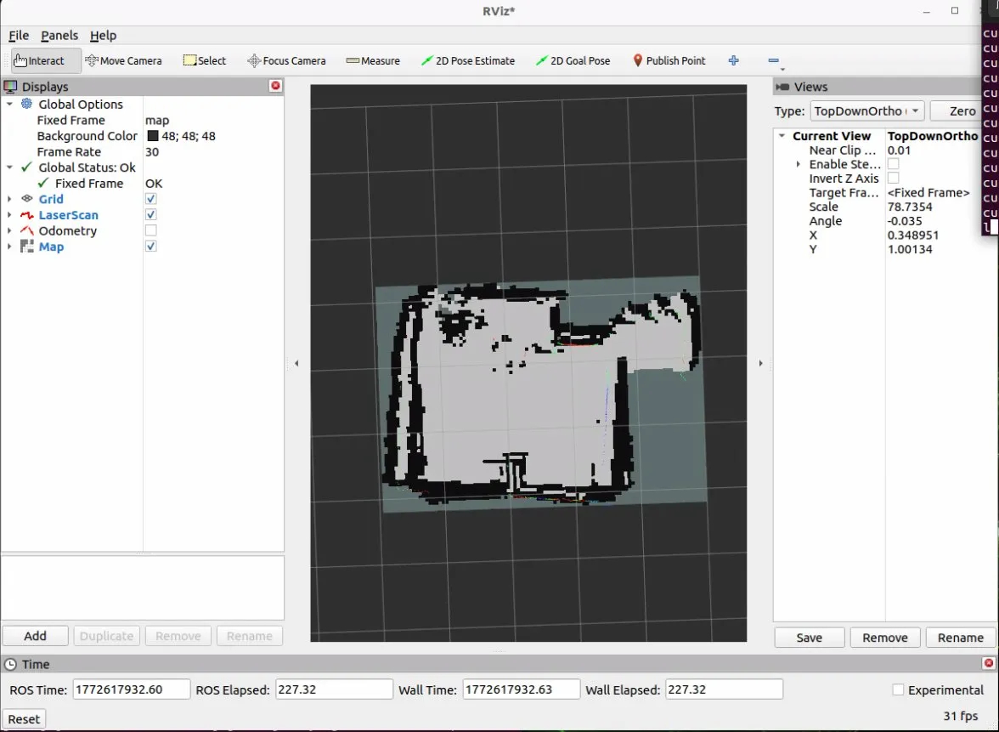
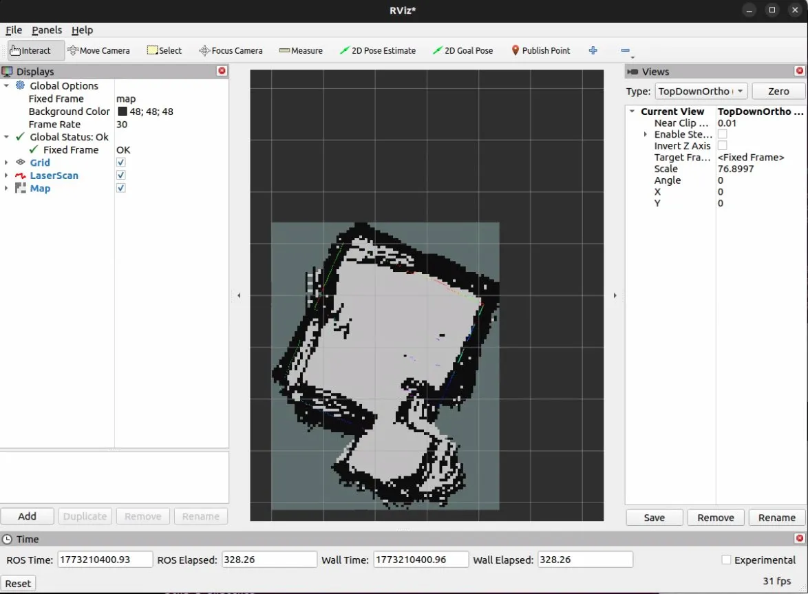

# Test Logs & Build Journal

## Purpose
This file serves as an index of all session logs. Each session has its own
dedicated file in this folder with full details.

---

## Session Index

| Session | Date | Title | Status |
|---------|------|-------|--------|
| 000 | 2026-02-16 | Project Kickoff & Parts Ordered | ✅ Complete |
| 001 | 2026-02-21 | Jetson Setup, Remote Access & UART Debugging | ✅ Complete |
| 002 | 2026-02-22 | UART Debugging & Breakthrough | ✅ Complete |
| 003 | 2026-02-22 | CAD Design — GRD Cover & RPLidar Mount | ✅ Complete |
| 004 | 2026-02-25 | Power Debugging, LiDAR Integration & ROS2 Motor Control | ✅ Complete |
| 005 | 2026-02-27 | URDF, tf2, and First SLAM Map | ✅ Complete |
| 006 | 2026-03-01 | Hardware Assessment & Platform Migration: Wave Rover → UGV02 | ✅ Complete |
| 007 | 2026-03-02 | Linear Scale Calibration & TRACK_WIDTH Investigation | ✅ Complete |
| 008 | 2026-03-03 | Automated Calibration Script & Battery Sag Discovery | ✅ Complete |
| 009 | 2026-03-04 | Hybrid Odometry (Gyro Heading + Encoder Linear) & First Proper SLAM Map | ✅ Complete |
| 010 | 2026-03-09 | Heading Hold, Velocity Ramp, ZUPT & PD Controller | ✅ Complete |
| 011 | 2026-03-13 | Universal Heading Hold Tune for Mixed Surfaces | ✅ Complete |

---

## Session 000 — 2026-02-16: Project Kickoff & Parts Ordered
**Goal:** Finalize platform choice, create GitHub repository, and order all components.

**Summary:** Platform research completed and all hardware decisions finalized.
Repository created and documentation structure set up. All components ordered
for ~$760 CAD total. No issues encountered.

---

## Session 001 — 2026-02-20: Jetson Setup, Remote Access & UART Debugging
**Goal:** Set up the Jetson Orin Nano Super, establish remote access,
and achieve working UART communication with the Wave Rover.

**Summary:** Jetson successfully flashed, configured, and updated to JetPack 6.2.1.
Remote access established via PuTTY (SSH) and NoMachine (desktop). ROS2 Humble
installed successfully. Rover wired to Jetson — no existing documentation for this
hardware combination, so the process was pieced together from multiple sources.
UART communication established but all received data was garbled. Continued in Session 002.

**→ [Full session log](2026-02-20-session-001-jetson-setup-uart-debugging.md)**

---

## Session 002 — 2026-02-22: UART Debugging & Breakthrough
**Goal:** Identify root cause of garbled UART data and establish working
communication with the Wave Rover.

**Summary:** Two compounding hardware issues identified and resolved. First, the
Jetson Nano Adapter (C) was inserted upside down, holding the ESP32's boot pin
at the wrong voltage. Second, the Jetson Orin Nano has a known ttyTHS1 data
corruption bug that requires RTS/CTS hardware flow control. Fixed by enabling
uarta-cts/rts in jetson-io and adding a jumper between pins 11 and 36. UART
communication fully working — rover moves on command from the Jetson. ✅

**→ [Full session log](2026-02-22-session-002-UART-breakthrough.md)**

---

## Session 003 — 2026-02-23: CAD Design — GRD Cover & RPLidar Mount

**Goal:** Finalize CAD designs for the custom GRD electronics cover and
RPLidar C1 mounting case while waiting for antenna and standoff spacers to arrive.

**Summary:** Both CAD designs completed in Fusion 360. The GRD cover is a
functional redesign of the rover's original plastic electronics bay cap, adding
openings for the 40-pin header, improved OLED visibility, and WiFi antenna cable
routing. The RPLidar C1 mount was designed from scratch to secure the sensor
to the rover. No physical assembly this session — parts still in transit.

**→ [Full session log](2026-02-22-session-003-cad-grd-cover-lidar-mount.md)**

---

## Session 004 — 2026-02-24: Power Debugging, LiDAR Integration & ROS2 Motor Control
**Goal:** Resolve power system fault from first full assembly boot, integrate the
RPLidar C1 into ROS2, and achieve complete rover motor control through the `/cmd_vel`
topic.
**Summary:** UPS power fault diagnosed and resolved — root cause was the Jetson's
Type-C standby draw overloading the 5V buck converter. Power architecture redesigned
to route both boards through the BAT rail, reserving the 5V output for peripherals.
Runtime analysis completed for the BENKIA 18650 pack across all Jetson power modes —
15W mode recommended for SLAM sessions (~56 min runtime). DisplayPort emulator ordered
to resolve headless NoMachine GPU issue. Persistent udev symlinks established for both
USB serial devices (`/dev/lidar`, `/dev/rover`). RPLidar C1 driver built from source
and confirmed publishing live `/scan` data. Rover communication switched to USB serial
for reliability. `rover_driver` ROS2 node written and deployed — full end-to-end motor
control via `/cmd_vel` confirmed. ✅

**→ [Full session log](2026-02-24-session-004-power-architecture-LiDAR-integration-ROS2-motor-control.md)**

---

## Session 005 — 2026-02-27: URDF, tf2, and First SLAM Map
**Goal:** Create the `robot_description` ROS2 package, configure SLAM Toolbox,
and achieve a live occupancy grid map in RViz2.

**Summary:** Authored a Unified Robot Description Format (URDF) with accurate
real-world LiDAR transform measurements — 0.1685m z offset derived from physical
measurement, with zero x/y offsets by deliberate mechanical design. Verified the
tf2 transform tree with `tf2_tools view_frames`. Installed SLAM Toolbox and wrote
a full `slam_toolbox.yaml` configuration. Deployed a SLAM launch file with a
static `odom → base_link` placeholder for future wheel odometry. Full pipeline
confirmed: RPLidar C1 → `/scan` → SLAM Toolbox → `/map` → RViz2, with a live
occupancy grid map of the room visible. ✅

**→ [Full session log](2026-02-27-session-005-URDF-tf2-and-first-SLAM-map.md)**

---

## Session 006 — 2026-02-28: Hardware Assessment & Platform Migration: Wave Rover → UGV02

**Goal:** Begin implementing encoder-based wheel odometry to replace the static
`odom → base_link` transform in `slam.launch.py`.

*Left: UGV02 with DCGM-370 encoder motors.  Right: Wave Rover with N20 motors.*

**Summary:** Investigation into the GRD firmware revealed that the Wave Rover's N20 motors
have no encoders — the GRD encoder commands are only functional on the UGV01 product.
Simultaneously, the Wave Rover was chronically underpowered under the Jetson's payload,
struggling to move on carpet and stalling below full throttle. Three remediation paths were
evaluated: open-loop odometry integration (rejected — no meaningful improvement over the
static transform), partial motor swap to encoder-capable N20s (rejected — encoders on an
underpowered chassis produce unreliable ground truth), and full platform replacement
(selected). The Waveshare UGV02 was chosen after reviewing the official wiki, which
explicitly confirms encoder motors (`DCGM-370-12V-EN-333RPM`, encoder confirmed by EN
designation and visible hall-effect sensor connector) and a Multi-Functional Driver board
with native ROS continuous feedback mode. The UGV02 was received and the full hardware
migration was completed: Jetson, RPLidar C1, and the custom BAT-rail power wire from
Session 004 all transferred to the new chassis. Both 3D-printed parts — the RPLidar
mounting case and GRD top cover — fit the new chassis without modification. A video
documenting the technical reasoning and hardware transformation was recorded and edited.

**→ [Full session log](2026-02-28-session-006-hardware-assessment-platform-migration.md)**

---

## Session 007 — 2026-03-02: First Teleoperated SLAM Run & Odometry Calibration

**Goal:** Run the full SLAM stack for the first time with a teleoperated robot and
produce a geometrically accurate map of the room.

**Summary:** Linear scale factor successfully calibrated from 0.03125 to 0.01 via a
1-metre drive test (0.34% error). With correct linear scale, SLAM produced its first
coherent room outline. Rotational calibration proved much harder: physical ruler
measurement of wheel spacing (0.172m) was revealed to be the wrong approach —
`TRACK_WIDTH` refers to the kinematic turning diameter, not the physical wheel gap.
Six values were tested through L-shape map analysis with no reliable result. The root
problem is that every calibration method derived rotation from the same encoders being
calibrated, with no independent ground truth. Crab-walking from the wobbly middle
passive wheels further complicated all tests.

**→ [Full session log](2026-03-02-session-007-odometry-calibration.md)**

---

## Session 008 — 2026-03-03: Automated Calibration Script & Battery Sag Discovery
**Goal:** Determine `TRACK_WIDTH` through automated sensor-referenced calibration and
attempt teleop SLAM mapping with corrected odometry.

**Summary:** Wrote a 3-phase Python calibration script: accelerometer bias calibration at
rest, gyroscope scale calibration via manual 360° rotation, and an automated 90° CW motor
turn with simultaneous gyro and encoder recording to compute `TRACK_WIDTH` directly. The
script's raw output revealed that the MFD board's `odl`/`odr` labels are physically
reversed — the encoder swap was causing heading to be reported with the wrong sign on every
turn. After correcting the swap, `TRACK_WIDTH` was determined to be 0.0456 m. Subsequent
SLAM mapping attempt failed due to battery voltage sag causing asymmetric motor output and
unreliable encoder timing. This led to the architectural decision to use gyroscope-based
heading combined with encoder-based linear displacement (gyrodometry) for Session 009,
eliminating `TRACK_WIDTH` as a calibration parameter entirely.

**→ [Full session log](2026-03-03-session-008-calibration-script-encoder-swap.md)**

---

## Session 009 — 2026-03-04: Hybrid Odometry & First Proper SLAM Map

**Goal:** Implement a hybrid odometry node sourcing heading from the gyroscope and
linear displacement from the encoder average, removing `TRACK_WIDTH` from the
architecture entirely. Produce a reliable teleop SLAM map with the new node.

**Summary:** Wrote and deployed a new `rover_driver_node.py` implementing gyrodometry:
`gz` gyroscope integration for heading, encoder average `(odl + odr) / 2` for linear
displacement. `GZ_SCALE = 0.001058 rad/(count·s)` was obtained via the Phase 2 hand
rotation procedure from `calibrate_track_width.py` and validated by a 90° motor turn
measuring 90.04°. The result was the first geometrically correct SLAM map — clean
rectangular walls, sharp corners, no doubling. A stale `~/install/` directory from an
earlier session was also discovered to be shadowing `~/ros2_ws/install/`, causing the node
to run the wrong file after every rebuild; the directory was permanently deleted.

**→ [Full session log](2026-03-04-session-009-hybrid-odometry-first-proper-slam-map.md)**

---

## Session 010 — 2026-03-09: Heading Hold, Velocity Ramp, ZUPT & PD Controller

**Goal:** Implement a software acceleration limiter to eliminate Jetson shutdown from
hard-acceleration current spikes, tune SLAM Toolbox parameters to reduce wall smearing,
and solve heading drift on soft surfaces that was degrading map quality over long sessions.

**Summary:** Confirmed the odometry projection math was already geometrically correct —
the drift problem was physical, not mathematical. Implemented a forward-only heading hold
PD controller (KP=1.6, KD=0.3) with gyro settle check, spike clamp, deadband, and a hard
output cap that keeps the rover tracking straight during SLAM runs. A software velocity
ramp (0.8 m/s² linear, 2.0 rad/s² angular) eliminated the Jetson shutdown caused by
hard-acceleration current spikes and improved motion smoothness as a side effect.
Zero Velocity Update (ZUPT) was implemented to continuously correct gyro bias drift at
every stationary pause throughout a session, addressing cumulative heading error that was
making longer sessions worse rather than better. Startup bias calibration was upgraded
from fixed-duration averaging to convergence-based standard deviation gating — switching
from peak-to-peak to std dev fixed a false-convergence-failure caused by single spike
outliers in an electrically noisy environment. SLAM Toolbox parameters were tuned for
full 10 Hz scan ingestion, larger loop closure search radius (15 m), and more tolerant
scan matching. Four mapping attempts across the session showed measurable improvement at
each step, with the final attempt producing the cleanest map to date — three tight walls
over two full perimeter laps.

**→ [Full session log](2026-03-09-session-010-heading-hold-velocity-ramp-zupt-slam-tuning.md)**

---

## Session 011 — 2026-03-13: Universal Heading Hold Tune for Mixed Surfaces
 
**Goal:** Validate the Session 010 heading hold PD controller on carpet and find a
single set of constants that works acceptably on both hard floors and soft surfaces,
without manual re-tuning between environments.
 
**Summary:** Testing the Session 010 heading hold constants on carpet exposed two
compounding failure modes: `HEADING_KP` had drifted to 2.2 (above the settled Session
010 value of 1.6, cause unknown), and `HEADING_DEADBAND` at 0.017 rad (~1°) was
narrower than the carpet vibration noise floor — causing the controller to generate
continuous phantom corrections on an already-correct heading. The goal was not a
carpet-specific tune but a universal baseline that tolerates soft surfaces without
breaking hard-floor performance. Two iterations were run with one battery charge and
no charger available: a first attempt at KD=0.4/DEADBAND=0.035 failed to fully
suppress surface jitter; a second at KD=0.5/DEADBAND=0.045 produced observably
improved straight-line tracking on carpet. Final universal constants: `HEADING_KP=1.4`,
`HEADING_KD=0.5`, `HEADING_DEADBAND=0.045 rad`, `GZ_MAX_RATE=2.0`. No SLAM map was
captured — battery constraints meant testing was rapid and observational. Result is
approximately 90% of the way toward the goal; a full validation mapping run across
both surfaces remains the next step.
 
**→ [Full session log](2026-03-13-session-011-universal-heading-hold-tune.md)**

---
