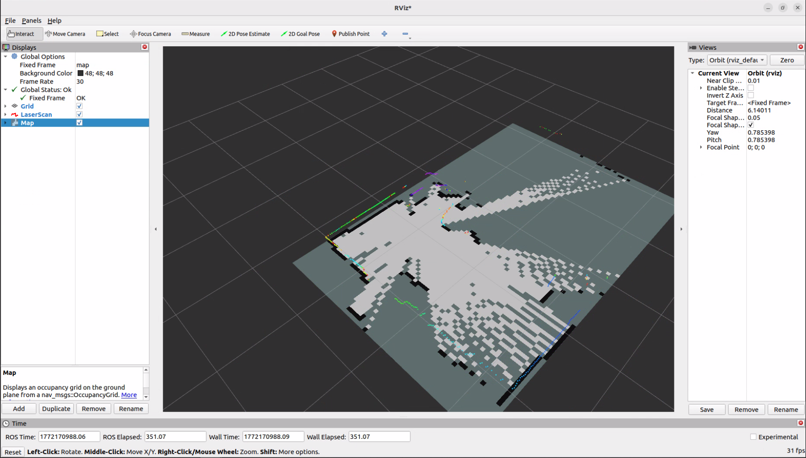

# Session 005 — URDF, tf2, and First SLAM Map

**Date:** 2026-02-27
**Status:** ✅ Complete

---

## Goal

Create the `robot_description` ROS2 package with a Unified Robot Description
Format (URDF), configure SLAM Toolbox, and achieve a live occupancy grid map
in RViz2.

---

## What Was Accomplished

1. Created the `robot_description` ROS2 package from scratch
2. Authored a Unified Robot Description Format (URDF) with accurate real-world
   LiDAR transform measurements
3. Verified the tf2 transform tree with `tf2_tools view_frames`
4. Installed SLAM Toolbox and wrote a full `slam_toolbox.yaml` configuration
5. Wrote a SLAM launch file with a static odometry placeholder
6. Achieved a live occupancy grid map in RViz2 — full SLAM pipeline confirmed working

---

## Software — robot_description Package

I created a new ROS2 package to hold the robot's Unified Robot Description
Format (URDF), SLAM configuration, and associated launch files:
```bash
cd ~/ros2_ws/src
ros2 pkg create robot_description --build-type ament_cmake
mkdir -p ~/ros2_ws/src/robot_description/urdf
mkdir -p ~/ros2_ws/src/robot_description/launch
mkdir -p ~/ros2_ws/src/robot_description/config
```

The `package.xml` was updated to declare runtime dependencies on
`robot_state_publisher` and `xacro`. The `CMakeLists.txt` was updated to
install the `urdf`, `launch`, and `config` directories into the package share
directory so they are accessible at runtime via `get_package_share_directory`.

---

## Software — Unified Robot Description Format (URDF)

**File:** `src/robot_description/urdf/rover.urdf`

I authored a Unified Robot Description Format (URDF) defining the physical
structure of the rover as a transform tree. The file defines two links and one
joint:

- `base_link` — the robot's root reference frame, placed at the center of the
  base. All other frames are defined relative to this.
- `laser` — the RPLidar C1's coordinate frame, with a cylinder visual for
  RViz2 display.
- `base_to_laser` — a fixed joint connecting `base_link` to `laser` with a
  measured z offset of 0.1685m.

**Transform measurement:**

The 0.1685m z offset was derived from two physical measurements:
- 180mm from the ground to the top surface of the RPLidar C1 housing
- 11.5mm from the top surface down to the actual laser scanning plane

180mm − 11.5mm = 168.5mm = **0.1685m**

The x and y offsets are both 0.0m. During the mechanical design phase I
deliberately positioned the LiDAR at the geometric center of the rover on
both horizontal axes. This was a conscious future-proofing decision — a
centered LiDAR produces a symmetric scan pattern that simplifies SLAM
configuration and eliminates any need to account for sensor offsets in the
transform tree, both now and in all future navigation work.
```xml
<?xml version="1.0"?>
<robot name="wave_rover">

  <link name="base_link"/>

  <link name="laser">
    <visual>
      <geometry>
        <cylinder length="0.04" radius="0.03"/>
      </geometry>
    </visual>
  </link>

  <joint name="base_to_laser" type="fixed">
    <parent link="base_link"/>
    <child link="laser"/>
    <origin xyz="0.0 0.0 0.1685" rpy="0 0 0"/>
  </joint>

</robot>
```

---

## Software — robot_state_publisher Launch File

**File:** `src/robot_description/launch/description.launch.py`

I wrote a launch file that starts the `robot_state_publisher` node, which
reads the Unified Robot Description Format (URDF) and continuously broadcasts
the `base_link` → `laser` transform into the tf2 tree. This is the prerequisite
for any ROS2 node that needs to know the sensor's position relative to the
robot — including SLAM Toolbox.

**Verification:**
```bash
ros2 launch robot_description description.launch.py
# [robot_state_publisher]: got segment base_link
# [robot_state_publisher]: got segment laser
```
```bash
ros2 run tf2_tools view_frames
# laser:
#   parent: 'base_link'
#   broadcaster: 'default_authority'
#   rate: 10000.000
```

Transform tree confirmed correct — `laser` parented to `base_link` at the
expected offset.

---

## Software — SLAM Toolbox Configuration

**File:** `src/robot_description/config/slam_toolbox.yaml`

I installed SLAM Toolbox and wrote a full configuration file:
```bash
sudo apt install ros-humble-slam-toolbox -y
```
```yaml
slam_toolbox:
  ros__parameters:
    # Topics and frames
    scan_topic: /scan
    base_frame: base_link
    odom_frame: odom
    map_frame: map
    # Mode
    mode: mapping
    # Solver
    solver_plugin: solver_plugins::CeresSolver
    ceres_linear_solver: SPARSE_NORMAL_CHOLESKY
    ceres_preconditioner: SCHUR_JACOBI
    # Scan matching
    minimum_travel_distance: 0.1
    minimum_travel_heading: 0.2
    scan_buffer_size: 10
    scan_buffer_maximum_scan_distance: 10.0
    link_match_minimum_response_fine: 0.1
    distance_penalty: 0.5
    angle_penalty: 1.0
    # Map
    resolution: 0.05
    max_laser_range: 12.0
    minimum_laser_range: 0.2
    # Performance
    use_scan_matching: true
    use_scan_barycenter: true
    loop_search_maximum_distance: 3.0
    do_loop_closing: true
```

Key parameter decisions:
- `mode: mapping` — building a map from scratch rather than localizing within
  an existing one
- `solver_plugin: CeresSolver` — Google's Ceres optimization library, the
  standard solver for SLAM Toolbox on resource-constrained systems
- `resolution: 0.05` — 5cm per map cell, standard for indoor mapping and a
  practical balance between detail and memory usage on the Jetson
- `max_laser_range: 12.0` — capped below the C1's rated 16m to exclude
  lower-reliability readings near maximum range
- `minimum_laser_range: 0.2` — matches the C1's minimum measurable distance
- `do_loop_closing: true` — enables loop closure to correct accumulated
  position drift when the rover revisits known areas

---

## Software — SLAM Launch File

**File:** `src/robot_description/launch/slam.launch.py`

I wrote a launch file that starts two nodes simultaneously:

1. `sync_slam_toolbox_node` — SLAM Toolbox's synchronous mapping mode,
   processing scans in order. Configured via `slam_toolbox.yaml`.
2. `static_transform_publisher` — publishes a static `odom → base_link`
   transform as a placeholder for wheel odometry, which has not yet been
   implemented. This satisfies SLAM Toolbox's requirement for a complete
   `map → odom → base_link → laser` transform chain.

The static odometry publisher is a deliberate development technique — it
allows the full SLAM pipeline to run end to end while wheel odometry
implementation is deferred to a future session. It will be replaced with
real encoder-based odometry once the `rover_driver` node is extended to
publish to the `/odom` topic.

---

## Result — First SLAM Map

With all four nodes running simultaneously across four terminals:

| Terminal | Node |
|----------|------|
| 1 | `robot_state_publisher` |
| 2 | `rplidar_ros` (RPLidar C1 driver) |
| 3 | SLAM Toolbox + static odom publisher |
| 4 | RViz2 |

SLAM Toolbox successfully subscribed to `/scan`, resolved the full tf2 chain,
and began publishing an occupancy grid to `/map`. RViz2 displayed a live map
of the room with white cells for open space, black cells for detected obstacles
and walls, and grey cells for unexplored areas. The coloured point cloud overlay
showed live RPLidar C1 scan data at 10Hz.

The map is noisy in its current state due to the static odometry placeholder —
with no real position feedback, SLAM Toolbox is working from a single reference
frame with no motion correction. Map quality will improve significantly once
the rover is driven through the environment and real odometry is introduced.

**Full pipeline confirmed:**

```
RPLidar C1 → /scan → SLAM Toolbox → /map → RViz2 ✅
```

---

## Known Issues / Notes

- The `minimum_laser_range` parameter in `slam_toolbox.yaml` is acknowledged
  by the node but does not suppress the startup warning
  `minimum laser range setting (0.0 m) exceeds the capabilities of the used
  Lidar (0.2 m)`. This appears to be a cosmetic issue in this version of
  SLAM Toolbox — the parameter is being read correctly and has no effect on
  mapping quality since the C1 physically cannot return readings below 0.2m.
- The `odom → base_link` transform is currently a static placeholder. Real
  wheel odometry from encoder feedback is deferred to Session 006.
- The `static_transform_publisher` startup warning
  `Old-style arguments are deprecated` is cosmetic and does not affect
  functionality.

---

## Repository Updates
```
src/
  ROS2/
    robot_description/
      urdf/
        rover.urdf
      launch/
        description.launch.py
        slam.launch.py
      config/
        slam_toolbox.yaml
      CMakeLists.txt
      package.xml
```
