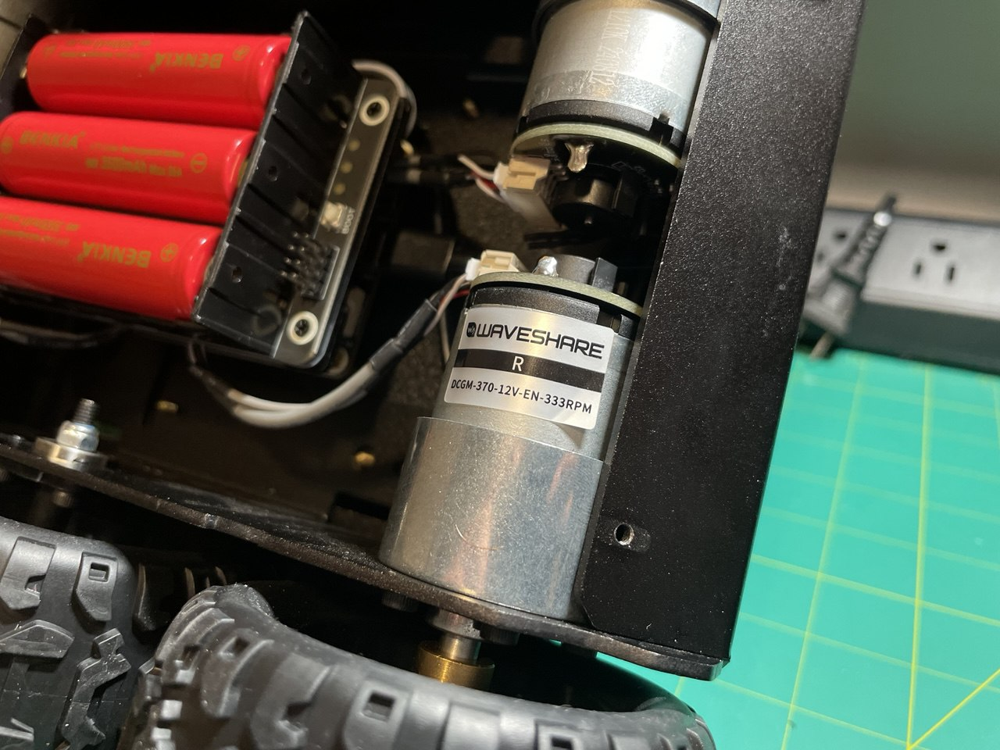
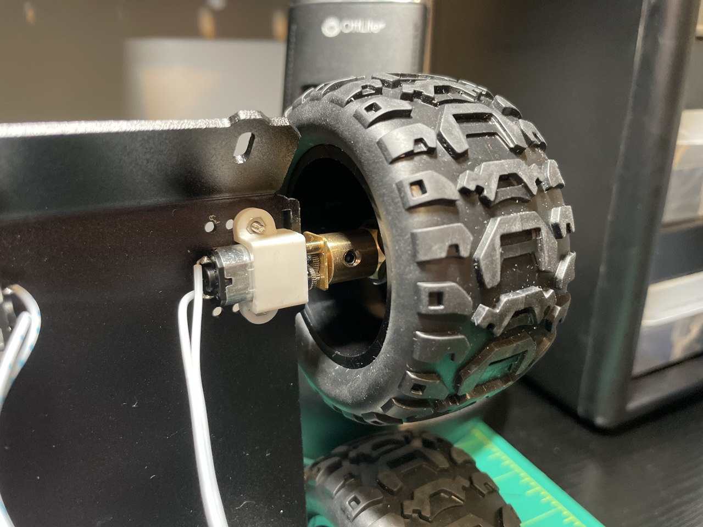
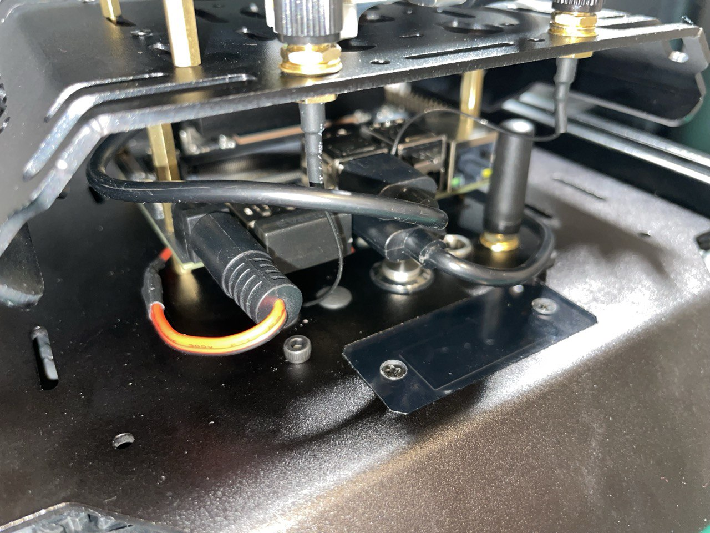
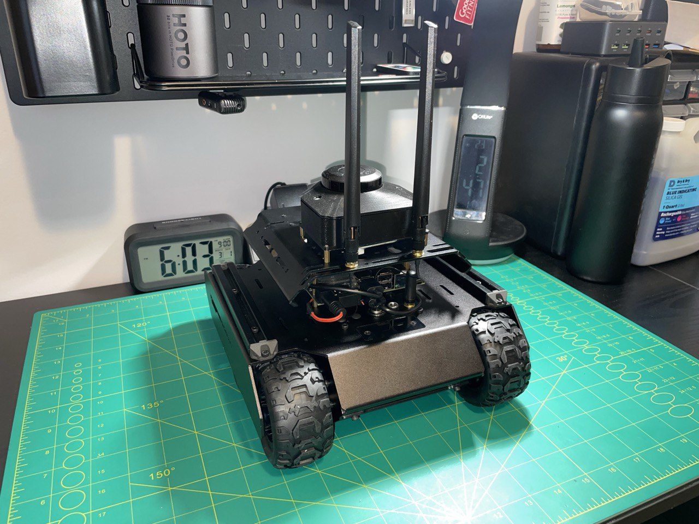

# Session 006 — Hardware Assessment & Platform Migration: Wave Rover → UGV02

**Date:** 2026-03-01  
**Status:** ✅ Complete

---

## Goal

Begin implementing encoder-based wheel odometry to replace the static `odom → base_link`
transform in `slam.launch.py`. The plan was to extend `rover_driver` to read encoder ticks
from the GRD over USB serial, compute velocities, and publish a `nav_msgs/Odometry` message
to `/odom`.

---

## What Was Accomplished

1. Discovered through firmware and hardware research that the Wave Rover platform lacks
   encoder-capable motors entirely — making real odometry unachievable on the current chassis
2. Identified a secondary issue: the Wave Rover was chronically underpowered, struggling
   to move reliably on carpet and unable to turn below full throttle under the Jetson's payload
3. Evaluated three remediation paths: open-loop odometry, partial motor swap, full platform
   replacement
4. Researched and evaluated multiple Waveshare platforms as candidates for replacement
5. Selected the UGV02 as the replacement platform based on documented hardware evidence
6. Received the UGV02 and completed full hardware migration: Jetson, RPLidar C1, and
   custom BAT-rail power wire all transferred to the new chassis

---

## Discovery 1 — Wave Rover Has No Encoder Motors

### What I Expected
The GRD board has encoder motor ports (Groups A and B, 6-pin PH2.0 connectors). I expected
to query the GRD firmware for encoder tick feedback and build odometry from that.

### What the Firmware Actually Said
Reviewing the GRD documentation revealed a critical line: *"This product is WAVE ROVER,
the motor used is without encoders."* The encoder commands in the GRD firmware are
explicitly noted as applying only to the UGV01 product. The Wave Rover's N20 motors have
no hall-effect sensors — there are no encoder ticks to read, regardless of how the software
is written.

### Why This Matters
Without encoder feedback, the only options for odometry are open-loop integration of
commanded velocities (unreliable, accumulates drift immediately), IMU-fused dead reckoning
(better, but still fundamentally odometry without ground truth), or replacing the hardware.
Open-loop odometry was rejected because it would not meaningfully improve SLAM quality — 
the rover would still have no real sense of how far it had actually traveled. I chose to
solve the problem at the hardware level rather than paper over it in software.

---

## Discovery 2 — Wave Rover Was Chronically Underpowered

### Observed Behavior
- Could not reliably move on carpet under the Jetson's weight
- Could not execute turns below maximum throttle
- This behavior worsened after the Jetson was mounted

### Root Cause
The Wave Rover uses N20 motors — small, lightweight motors originally designed for compact
consumer robots. The N20 form factor was never designed to carry the combined weight of the
Jetson Orin Nano Super Developer Kit, UPS module, RPLidar C1, and 3D-printed mounts.
The chassis was simply operating at the edge of its physical capability.

This compounded the odometry problem: even if encoders had been retrofitted, inconsistent
wheel contact and stall conditions on carpet would have produced unreliable tick counts,
making closed-loop odometry nearly as bad as open-loop on this platform.

*Left: Wave Rover underside with N20 motors. Right: UGV02 underside with DCGM-370 encoder
motors. The motor size difference is the torque argument made visible.*

---

## Platform Evaluation

Three remediation paths were evaluated against four criteria: financial cost, time cost,
technical viability, and long-term utility across future projects.

| | **Option A** — Open-Loop Odometry | **Option B** — Encoder Motor Swap | **Option C** — Platform Replacement ✅ |
|---|---|---|---|
| **Cost** | $0 | ~$50 CAD (4× encoder motors) | ~$195 CAD net ($370 UGV02 − $175 Wave Rover return) |
| **Time Cost** | Negligible | ~2 days (sourcing, shipping, swap) | ~1 day (hardware migration) |
| **Pros** | Zero cost, zero downtime | Relatively inexpensive; no changes to chassis geometry, URDF, or software configuration | Significantly higher motor torque; MFD board with 4 encoder ports and ROS-native firmware; DCGM-370 encoder motors included; 4 kg payload rating |
| **Cons** | Odometry is immediately and severely inaccurate — drift accumulates from the first wheel rotation with no mechanism for correction | Still underpowered under Jetson payload; GRD only exposes 2 encoder ports; wheel slip on an undersized chassis makes even encoder readings unreliable | Cost |
| **Future Outlook** | Not viable beyond a demo. Mapping quality would degrade rapidly in any real environment and the approach cannot carry forward to future projects | Not future-proof — addresses only this project, on this chassis, with this payload. Not expandable beyond the GRD's hardware limitations | Directly future-proofs the platform. The MFD board and DCGM-370 motor class are the foundation of Waveshare's ROS-oriented product line, making this chassis suitable for the SLAM work ahead and the computer vision projects planned after |
| **Outcome** | ❌ Rejected | ❌ Rejected | ✅ Selected |

### Decision Rationale

Option A was rejected because it treats a hardware problem as a software problem — there is
no amount of integration cleverness that compensates for having no feedback signal at all.
The resulting odometry would be unreliable from the first drive cycle and would actively
degrade SLAM map quality rather than improve it.

Option B was rejected because it solves the wrong problem first. Fitting encoders to an
underpowered chassis does not fix the underpowering — it produces unreliable encoder data
instead of no encoder data. The Wave Rover's N20 motors were not sized for the Jetson's
payload, and that physical constraint cannot be patched in firmware.

Option C was selected because it resolves both problems simultaneously at their root and
produces a platform that is genuinely suitable for the remaining work on this project and
the projects that follow.

---

## Platform Selection: UGV02

### Research Process
I reviewed the official Waveshare UGV02 wiki in full. Two key findings confirmed the UGV02
as the correct choice:

**Motors:** The UGV02 wiki states explicitly under the CMD_SPEED_CTRL JSON command:
*"The product model is UGV02, the motor comes with encoder."*
The motors installed on the received unit are labeled `DCGM-370-12V-EN-333RPM`. The `EN`
designation in the part number confirms encoder-equipped. The DCGM-370 is Waveshare's
branded variant of the JGB37-520 motor class — a 37mm-diameter industrial-grade DC geared
motor. Confirmed and cross-referenced specifications:

*Motor label on the installed hardware. `EN` confirms encoder-equipped. The 37mm can body
is substantially larger than the N20 used on the Wave Rover.*

| Parameter | Value | Source |
|---|---|---|
| Model | DCGM-370-12V-EN-333RPM | Motor label (physical) |
| Rated voltage | 12V | Motor label (physical) |
| No-load speed | 333 RPM | Motor label (physical) |
| Encoder type | AB dual-phase incremental magnetic Hall | JGB37-520 class spec |
| Encoder PPR | 20 PPR at output shaft | JGB37-520 333RPM class spec |
| Rated torque | ~1.5 kg·cm | JGB37-520 333RPM class spec |
| Stall torque | ~5.0 kg·cm | JGB37-520 333RPM class spec |
| Rated current | ~1.0A | JGB37-520 333RPM class spec |
| Stall current | ~2.3A | JGB37-520 333RPM class spec |
| Motor diameter | 37mm | Physical measurement class |
| Encoder connector | XH2.54-6PIN | Waveshare DCGM series standard |

The stall torque (~5.0 kg·cm) is conservatively 5× the N20's estimated ceiling, which
resolves the underpowering issue. Exact Waveshare-published specs for the DCGM-370
specifically will be confirmed before the odometry PPR calculations in Session 007.

*N20 motor on the Wave Rover*

**Driver Board:** The UGV02 ships with the Multi-Functional Driver board (MFD), confirmed
by the firmware binary name `ROS_Driver_UGV_Rover.ino.bin` visible in the Waveshare flash
tool. The MFD provides 4× encoder motor ports and includes a continuous serial feedback
mode (`{"T":131,"cmd":1}`) explicitly described as *"suitable for the ROS system."*

**Payload:** The UGV02 is rated at 4 kg — well above the combined weight of the Jetson
Orin Nano Super Developer Kit, UPS Module 3S, RPLidar C1, and mounting hardware.

### What Transfers Directly
- NVIDIA Jetson Orin Nano Super (primary compute)
- RPLidar C1 and all udev rules (`/dev/lidar` symlink)
- UPS Module 3S and custom BAT-rail power wire
- Entire ROS2 software stack (SLAM Toolbox config, launch files, `rover_driver` node
  architecture, `robot_description` package)
- All documentation methodology and GitHub structure
- **RPLidar C1 mounting case** (3D-printed) — fits the UGV02 chassis without modification
- **GRD top cover** (3D-printed) — fits the UGV02 chassis without modification

The two custom-printed parts surviving the platform transition was an unexpected outcome.
Both designs were modeled around the Waveshare board and sensor geometry rather than the
Wave Rover chassis specifically, which is what made them compatible.

### What Requires Rework
- URDF measurements (new wheelbase, wheel radius, and LiDAR mounting height)
- `rover_driver` node protocol adaptation (MFD firmware uses `ugv_base_ros` — JSON
  command syntax must be verified against UGV02 command set)
- udev symlink for rover serial port (`/dev/rover`) — same process, new device if USB ID differs

---

## Hardware Migration

### What Was Transferred
All primary hardware components were unmounted from the Wave Rover and remounted on the
UGV02 chassis:

- Jetson Orin Nano Super Developer Kit
- RPLidar C1 (via Type-C USB adapter directly to Jetson)
- Custom BAT-rail power wire (fabricated in Session 004 to route Jetson power through
  the 9–12.6V BAT rail, keeping the 5V rail reserved for MFD peripherals only)

*Custom BAT-rail power wire transferred and reconnected inside the UGV02 chassis.
The Session 004 power architecture carries forward unchanged.*

### New Board: Multi-Functional Driver (MFD)
The UGV02's onboard driver is the MFD, replacing the GRD used on the Wave Rover.
Key differences relevant to this project:

| Feature | GRD (Wave Rover) | MFD (UGV02) |
|---|---|---|
| Encoder motor ports | 2× (Groups A & B) | 4× |
| Firmware | ugv_base_general | ugv_base_ros |
| Continuous feedback | No | Yes — `{"T":131,"cmd":1}` |
| ROS integration | Manual JSON bridge | Native ROS mode |
| Motor type (shipped) | N20, no encoders | DCGM-370-12V-EN-333RPM, encoders included |

---

## Documentation & Video

I recorded a video for this session covering:
- The technical reasoning behind the platform switch
- The three options evaluated and why options A and B were rejected
- Time-lapse footage of the hardware disassembly and reassembly

*UGV02 with Jetson Orin Nano Super and RPLidar C1 fully migrated and
mounted. The 3D-printed LiDAR case and top cover were transferred without modification.*

---

## Lessons Learned

**Verify hardware capabilities against software requirements before committing to a platform.**
The Wave Rover's lack of encoder motors was documented in the GRD firmware source — a
thorough pre-build hardware audit would have caught this before assembly. For future hardware
selection, confirm encoder availability, payload ratings, and driver board capabilities
explicitly, not by assumption.

**Underpowering is not a software problem.** The Wave Rover's motor performance degraded
under real payload conditions in ways that no ROS2 node can compensate for. Proper torque
margin is a prerequisite for reliable odometry, not an optional enhancement.

**Platform switches mid-project are a normal part of engineering.** The decision to switch
was driven by documented evidence and evaluated against defined requirements. The entire
ROS2 software stack transfers intact — the investment in Sessions 001–005 is preserved.
What changed is the mechanical foundation that the software runs on.

---

## Next Steps

- Confirm DCGM-370 torque and encoder PPR specs directly against Waveshare documentation
- Verify MFD JSON command compatibility with existing `rover_driver` node
- Re-measure URDF parameters: wheelbase, wheel radius, LiDAR mounting height
- Update `robot_description` URDF with UGV02 geometry
- Update udev rules for new `/dev/rover` device if USB ID differs from GRD
- Implement encoder-based wheel odometry using MFD continuous feedback mode
- Replace static `odom → base_link` transform in `slam.launch.py` with real odometry
