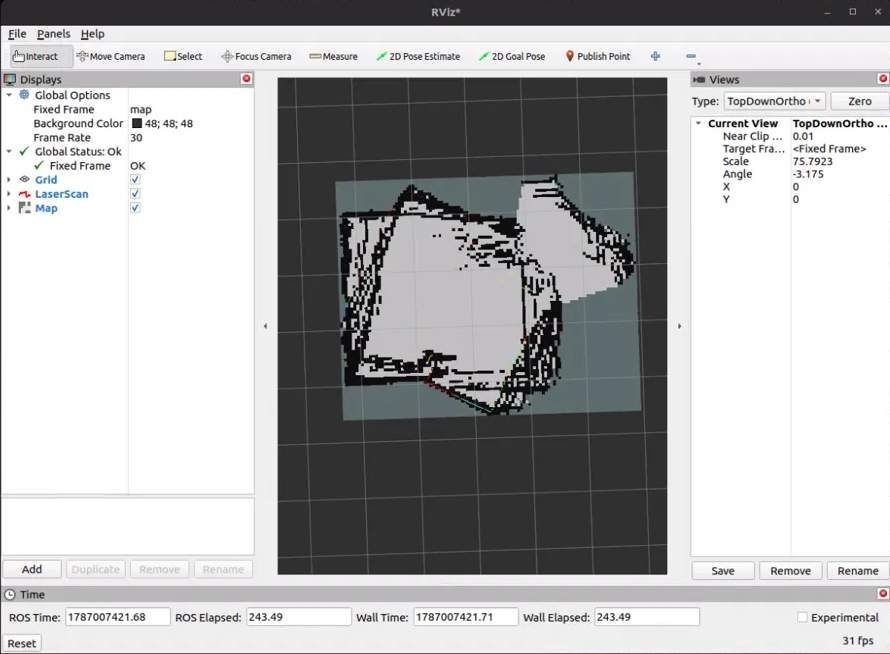
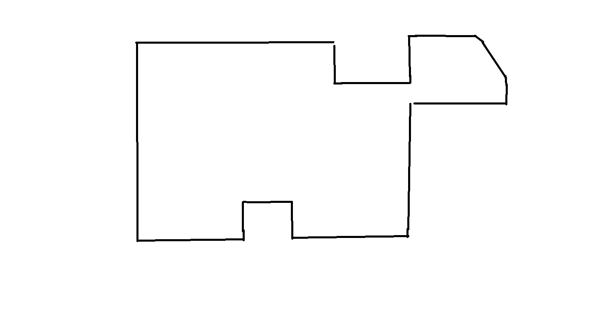
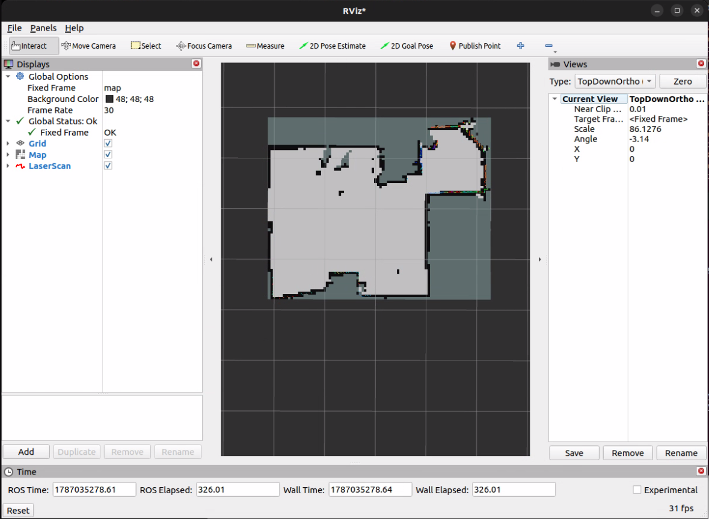

# Session 012 — 2026-08-18: Switching to Lidar-Based Odometry

## Goal

Return to the project after several months away, establish where things actually stand,
and get past the map quality problem that has blocked the Nav2 milestone since Session
010.

---

## Discovery 1 — Nothing Had Changed While I Was Gone

I had been away from the project for months. The first thing I did was boot the rover
with the Session 011 universal constants unchanged — `KP=1.4`, `KD=0.5`,
`DEADBAND=0.045`, `GZ_MAX_RATE=2.0` — and run a mapping loop at a slow teleop speed to
see where the system stood.

It stood exactly where I left it. The map came out geometrically wrong: a rounded,
lopsided polygon with no straight walls and no right angles, in a room that is
rectilinear.



For comparison, this is the actual geometry of the room:



I checked whether `GZ_SCALE` was to blame by driving two verified 90° turns and reading
the heading from `/odom_wheel`. The gyro reported -91.87° and -89.86°, totalling
-181.74° against a target of -180° — under 1% error. The calibration was fine and the
map was still wrong.

---

## Discovery 2 — Deciding the Gyro Was the Wrong Foundation

Coming back with fresh eyes and a few months of learning behind me, I reached a
conclusion I had not reached in previous sessions: gyro-based odometry was never going
to be reliable here, no matter how well it was calibrated.

The reason is that the calibration itself is conditional. Session 011 already
demonstrated that constants tuned on a hard floor do not transfer to carpet, because
the vibration noise floor changes with the surface. Beyond that, gyroscope bias drifts
with temperature, which means a calibration valid at boot is not necessarily valid
thirty minutes into a session. Chasing that with better tuning is chasing a moving
target.

The lidar is the only sensor on the rover unaffected by either. It does not care what
surface the robot is driving on and it does not drift as the electronics warm up. Its
main weakness is very large spaces, where the geometry falls outside its range — which
is not a realistic operating condition for this robot.

So the decision was to stop using dead reckoning to determine the robot's position and
use the lidar for it instead.

---

## Discovery 3 — How to Actually Do It

The method is RF2O — Range Flow-based 2D Odometry. It estimates planar motion directly
from consecutive laser scans by aligning them on scan gradients, and exists specifically
for mobile robots with unreliable base odometry. The ROS2 fork from Adlink-ROS built
cleanly on Humble.

Two things had to change on the rover side before it could be used.

**TF ownership.** `rover_driver_node` was broadcasting `odom → base_link`, and RF2O
broadcasts the same transform. A TF edge can only have one publisher — two nodes
broadcasting the same edge produces a transform that alternates between disagreeing
sources, which would corrupt slam_toolbox's motion prior without raising any error. I
commented out the 13-line TF broadcast block in `rover_driver_node.py` (lines 407–419)
so RF2O owns the edge outright.

**Topic collision.** The driver's wheel odometry was renamed from `/odom` to
`/odom_wheel` so both odometry sources can run side by side for comparison.

The driver keeps motor control, heading hold, and `/imu/gz` publishing. It simply no
longer asserts where the robot is.

---

## Discovery 4 — RF2O Waits Forever on a Topic That Doesn't Exist

RF2O launched and spammed `Waiting for laser_scans....` indefinitely, with no error and
no crash.

Everything obvious checked out. `/scan` was publishing at a clean 10 Hz. The
subscription was registered. The QoS combination — RELIABLE publisher to BEST_EFFORT
subscriber — is a valid match, not a mismatch. The `base_link → laser` transform
resolved, and the scan `frame_id` matched it exactly. Running with `--log-level debug`
produced hundreds of lines and not a single exception.

The answer was in that debug output, in a line I had scrolled past:

```
[rcl]: Initializing subscription for topic name '/base_pose_ground_truth'
```

RF2O's `init_pose_from_topic` parameter defaults to `/base_pose_ground_truth` — a
simulation topic used for benchmarking against ground truth, which nothing on this robot
publishes. The node holds initialisation waiting for a pose that never arrives.

Setting it empty starts the node at origin instead. The shell quoting is fiddly; a bare
`''` gets stripped by bash and fails rcl's parser, so the quotes have to be nested:

```bash
ros2 run rf2o_laser_odometry rf2o_laser_odometry_node --ros-args \
  -p laser_scan_topic:=/scan \
  -p odom_topic:=/odom \
  -p base_frame_id:=base_link \
  -p odom_frame_id:=odom \
  -p 'init_pose_from_topic:=""' \
  -p publish_tf:=true \
  -p freq:=10.0
```

The node initialised immediately.

The lesson is procedural: a node subscribing to a topic I never configured is an
anomaly, and should be the first thing I investigate rather than the last.

---

## Result

Before mapping, I verified the odometry in isolation with only the lidar and RF2O
running. `/odom` published at a steady 10 Hz, execution time was 28–37 ms per scan
against a 100 ms budget, and pushing the rover by hand produced sensible translation
that reversed sign correctly with direction — position derived entirely from lidar, with
no encoder or gyro input at all.

The mapping run that followed produced the first genuinely useful map of the entire
project. Single-cell-thick walls, sharp corners, and the chamfer, wall protrusion, and
alcove all in the right places at the right angles.



Saved to `~/maps/s012_rf2o_run2.pgm` — an 88 × 72 grid at 0.05 m/pixel.

### Architecture after this session

| Component | Publishes | Owns TF |
|---|---|---|
| `rplidar_ros` | `/scan` @ 10 Hz | — |
| `rf2o_laser_odometry` | `/odom` @ 10 Hz | **`odom → base_link`** |
| `rover_driver` | `/odom_wheel`, `/imu/gz` | none (TF disabled) |
| `slam_toolbox` | `/map` | `map → odom` |
| static publisher | — | `base_link → laser` |

---

## Next Session Tasks

**Write a proper launch file.** RF2O currently runs from a bare `ros2 run` with seven
inline `--ros-args`. It needs a params YAML and a launch file folded into
`slam.launch.py` so the whole stack comes up with one command.

**Watch CPU headroom.** RF2O execution time crept from 28 ms to 39 ms with only the
lidar running alongside it, and RViz logged continuous message-filter drops under the
full stack. If execution time approaches 100 ms, RF2O will start skipping scans.

**Test in unfavourable geometry.** RF2O degrades where consecutive scans look alike —
long corridors, blank walls. This room is feature-rich and easy. Somewhere harder needs
trying before this can be called robust.

**Then Nav2.** With a geometrically correct map, the blocker that has held the milestone
since Session 010 is cleared.
